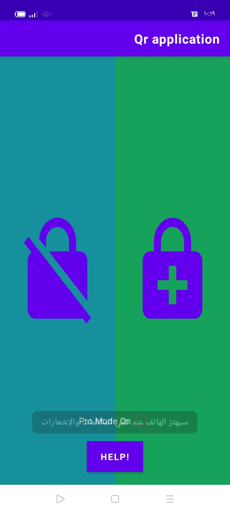
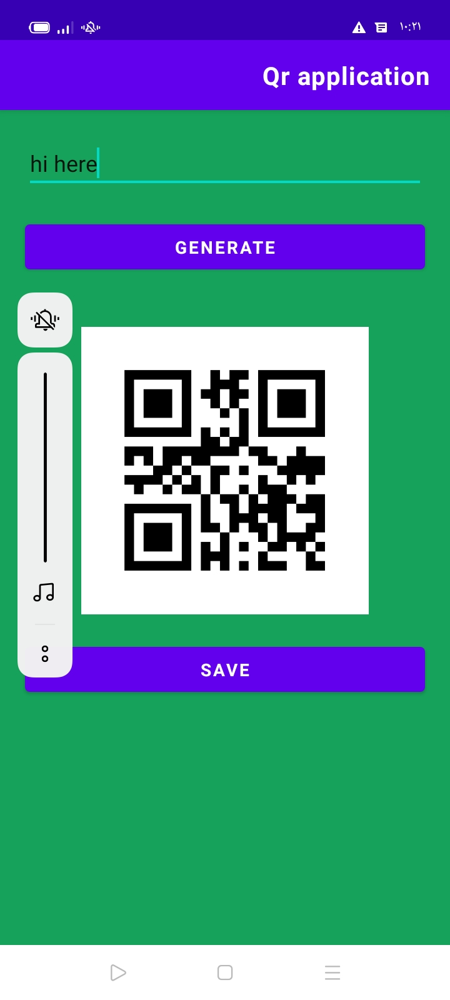
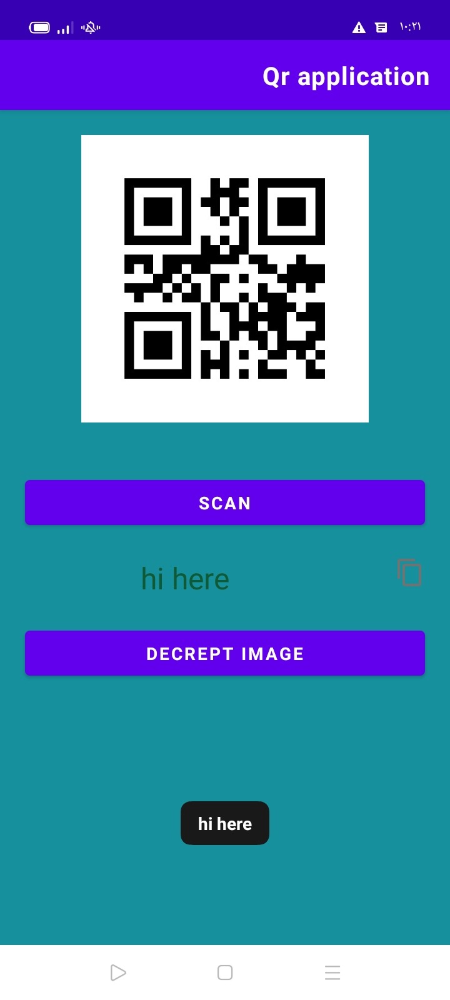

# qr-application-make-store-read

# QR Application

## Overview

The QR Application is a tool designed to create and store QR codes. It provides functionality for generating QR codes based on user input and managing stored QR codes for future reference.

## Features

- **QR Code Generation**: Create QR codes from text or URLs.
- **QR Code Storage**: Save generated QR codes for future access.
- **User-Friendly Interface**: Easily navigate and interact with the application to manage QR codes.

## Technologies Used

- JavaScript/TypeScript for QR code generation and application logic
- HTML/CSS for user interface design
- Optional: Libraries or frameworks used for QR code generation and storage

## Usage
1. Generate QR Codes: Enter text or a URL into the input field and click the button to generate a QR code.
2. Store QR Codes: Save the generated QR code using the application's storage functionality.
3. Access Stored QR Codes: Retrieve and view previously stored QR codes through the application interface.

* this app is make to you qr code and read it for you

* you can generate qr and save it

